# NIGHTWATCH Architecture

System architecture documentation with diagrams.

## System Overview

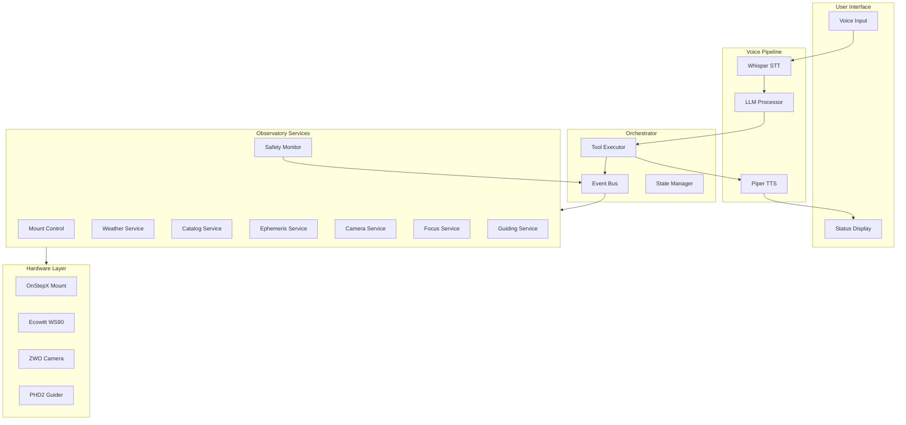

## Voice Command Flow

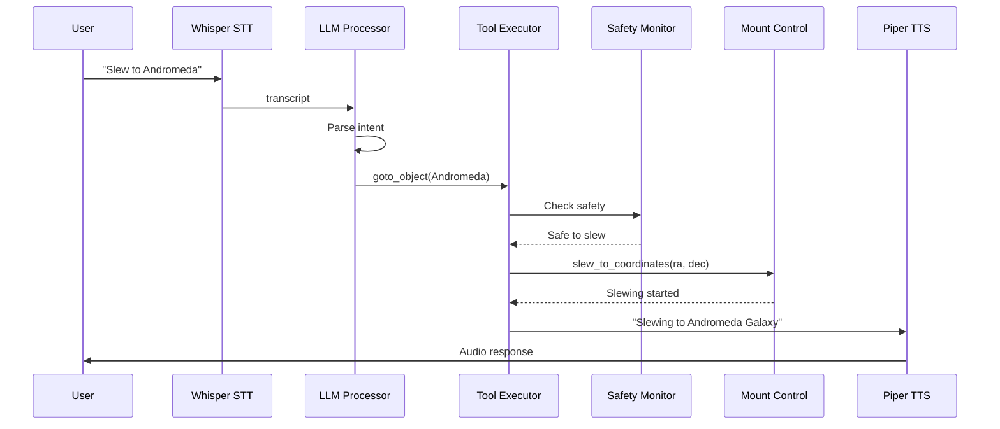

## Safety System Architecture

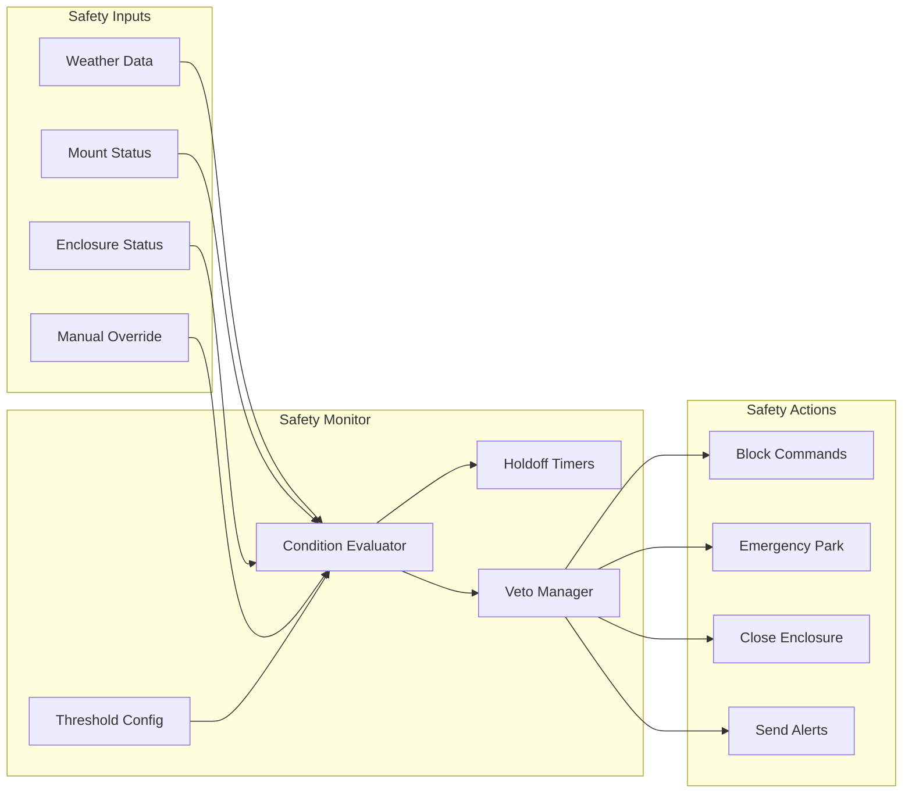

## Service Communication

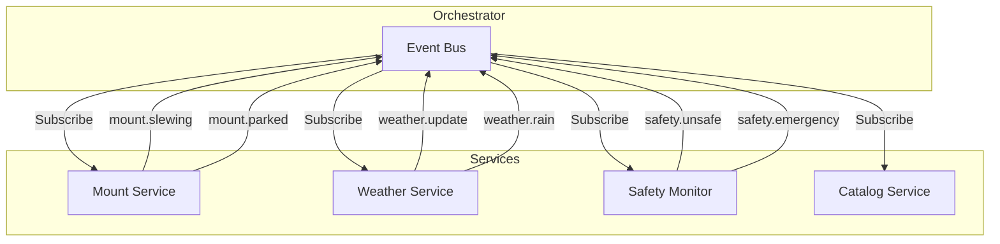

## Data Flow Architecture

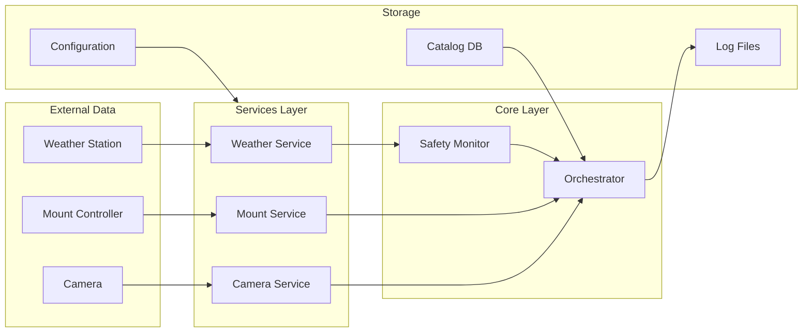

## Emergency Response Flow

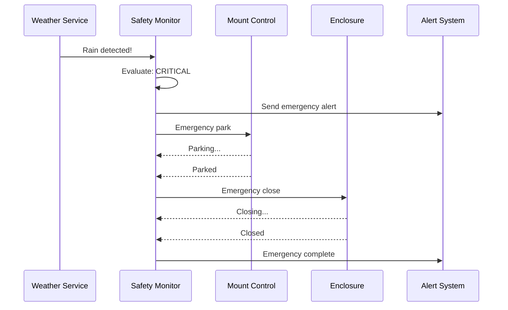

## Hardware Connectivity

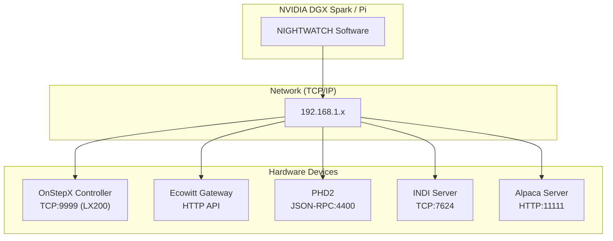

## Catalog Lookup Flow

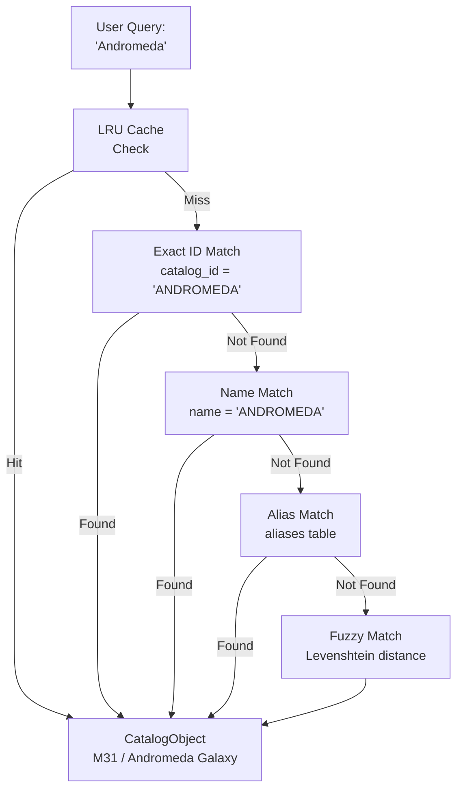

## Deployment Architecture

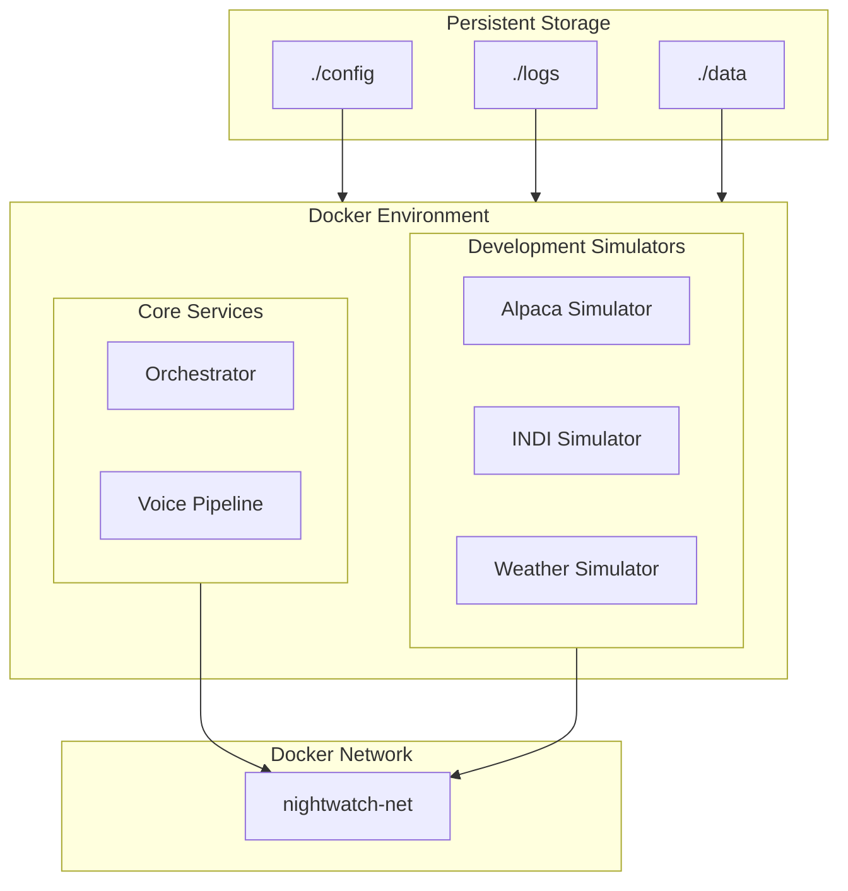

## State Machine: Mount Operations

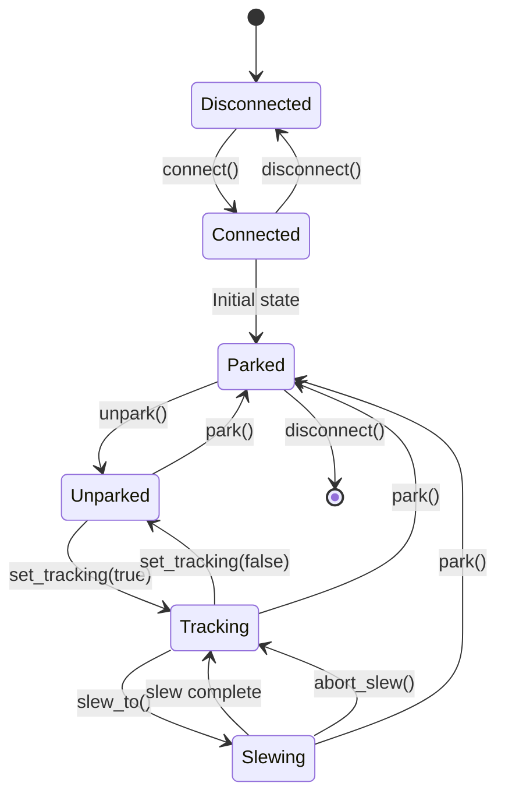

## Module Dependencies

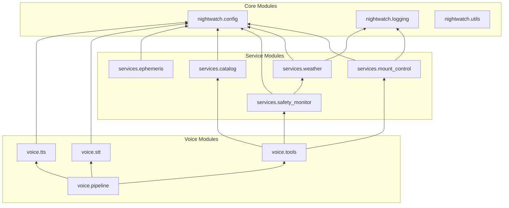

---

## Component Descriptions

### Voice Pipeline
- **Whisper STT**: OpenAI's speech-to-text model (faster-whisper implementation)
- **LLM Processor**: Local LLM for intent parsing and tool selection
- **Piper TTS**: Neural text-to-speech for natural responses

### Observatory Services
- **Mount Control**: OnStepX communication via LX200 protocol
- **Weather Service**: Ecowitt integration for environmental monitoring
- **Safety Monitor**: Rule-based safety evaluation with vetoes
- **Catalog Service**: SQLite-based astronomical object database
- **Ephemeris Service**: Skyfield-based celestial calculations

### Hardware Interfaces
- **OnStepX**: TCP/IP socket with LX200/extended commands
- **Ecowitt**: HTTP REST API on local gateway
- **Alpaca**: ASCOM Alpaca REST API standard
- **INDI**: XML-based telescope control protocol
